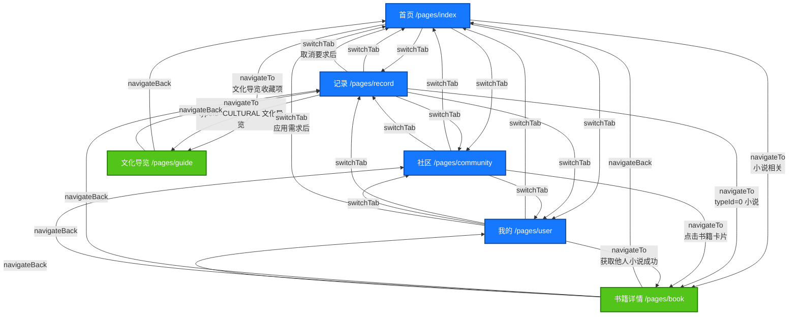

# 路听系统 - 多页面跳转图

## 📱 系统架构概述

本系统是基于 uni-app 开发的跨平台应用（支持 H5 和微信小程序），采用 TabBar + 普通页面的导航结构。

---

## 🗺️ 页面结构总览

### 核心页面列表

| 页面路径 | 页面名称 | 类型 | 说明 |
|---------|---------|------|------|
| `/pages/index` | 首页 | TabBar | 地图导航、文化导览、小说模式 |
| `/pages/record` | 记录 | TabBar | 用户收藏记录、历史轨迹 |
| `/pages/community` | 社区 | TabBar | 社区书架、分享书籍 |
| `/pages/user` | 我的 | TabBar | 个人信息、需求管理 |
| `/pages/book` | 书籍详情 | 普通页面 | 小说阅读、书籍详情 |
| `/pages/guide` | 文化导览 | 普通页面 | 文化导览详情 |

---

## 🔄 页面跳转关系图



---

## 📋 详细跳转说明

### 1️⃣ TabBar 页面间切换

**跳转方式：** `uni.switchTab()`

所有 TabBar 页面之间可以自由切换：
- 首页 ↔ 记录
- 首页 ↔ 社区
- 首页 ↔ 我的
- 记录 ↔ 社区
- 记录 ↔ 我的
- 社区 ↔ 我的

**特点：**
- 使用 `switchTab` 会关闭其他非 TabBar 页面
- 保留当前 TabBar 页面的状态

---

### 2️⃣ 首页 (`/pages/index`) → 其他页面

#### 2.1 首页 → 书籍详情页

**触发场景：**
- 小说模式下选择目的地开始导航
- 继续听功能跳转到之前未读完的小说

**跳转代码：**
```javascript
uni.navigateTo({
  url: `/pages/book/book?bookId=${bookId}`
})
```

**参数：**
- `bookId`: 书籍 ID

---

#### 2.2 首页 → 文化导览页

**触发场景：**
- 从收藏记录中点击文化导览项（通过 record 页面中转）

**跳转代码：**
```javascript
uni.navigateTo({
  url: `/pages/guide/guide?guideId=${guideId}`
})
```

**参数：**
- `guideId`: 文化导览 ID

---

### 3️⃣ 记录页 (`/pages/record`) → 其他页面

#### 3.1 记录页 → 书籍详情页

**触发条件：** `record.typeId === Love.BOOK (0)`

**跳转代码：**
```javascript
// 调用 navigateToBookDetail 方法
uni.navigateTo({
  url: `/pages/book/book?bookId=${record.id}`,
  success: (res) => {
    console.log('跳转成功:', res)
  },
  fail: (error) => {
    console.error('跳转失败:', error)
    uni.showToast({
      title: `跳转失败：${error.errMsg}`,
      icon: 'none',
      duration: 3000
    })
  }
})
```

**异常处理：**
- 校验 `bookId` 是否有效
- 捕获跳转失败错误并提示用户

---

#### 3.2 记录页 → 文化导览页

**触发条件：** `record.typeId === Love.CULTURAL`

**跳转代码：**
```javascript
uni.navigateTo({
  url: `/pages/guide/guide?guideId=${record.id}`,
  success: (res) => {
    console.log('跳转成功:', res)
  },
  fail: (error) => {
    console.error('跳转失败:', error)
    uni.showToast({
      title: `跳转失败：${error.errMsg}`,
      icon: 'none',
      duration: 3000
    })
  }
})
```

**注意：**
- 根据记忆中的经验，文化导览收藏项应跳转至 guide 页面
- 包含完整的错误处理和日志记录

---

#### 3.3 记录页 → 首页

**触发场景：**
- 取消需求要求后

**跳转代码：**
```javascript
uni.switchTab({ 
  url: '/pages/index/index' 
})
```

---

### 4️⃣ 社区页 (`/pages/community`) → 其他页面

#### 4.1 社区页 → 书籍详情页

**触发场景：**
- 点击社区书架中的书籍卡片

**跳转代码：**
```javascript
// handleBookClick 方法
if (!book.id) {
  uni.showToast({
    title: '书籍ID不存在',
    icon: 'none'
  })
  return
}

uni.navigateTo({
  url: `/pages/book/book?bookId=${book.id}`,
  fail: (error) => {
    uni.showToast({
      title: '跳转失败，请重试',
      icon: 'none'
    })
  }
})
```

**参数校验：**
- 检查 `book.id` 是否存在
- 提供友好的错误提示

---

### 5️⃣ 用户页 (`/pages/user`) → 其他页面

#### 5.1 用户页 → 书籍详情页

**触发场景：**
- 获取他人小说成功后查看

**跳转代码：**
```javascript
// viewReceivedBook 方法
if (!this.receivedBook || !this.receivedBook.id) {
  uni.showToast({
    title: '书籍信息不完整',
    icon: 'none'
  })
  return
}

// 先关闭弹窗
this.closeGetBookModal()

// 跳转到书籍页面
uni.navigateTo({
  url: `/pages/book/book?bookId=${this.receivedBook.id}`,
  success: () => {
    console.log('跳转到书籍页面成功')
  },
  fail: (error) => {
    console.error('跳转失败:', error)
    uni.showToast({
      title: '跳转失败',
      icon: 'none'
    })
  }
})
```

**流程：**
1. 校验书籍信息完整性
2. 关闭获取小说弹窗
3. 执行页面跳转
4. 处理成功/失败回调

---

#### 5.2 用户页 → 首页

**触发场景：**
- 应用需求成功后

**跳转代码：**
```javascript
uni.switchTab({ 
  url: '/pages/index/index' 
})
```

---

### 6️⃣ 详情页返回操作

#### 6.1 书籍详情页 → 返回上一页

**跳转方式：** `uni.navigateBack()`

**触发场景：**
- 点击返回按钮
- 阅读完成后返回

**跳转代码：**
```javascript
uni.navigateBack({
  delta: 1,
  fail: () => {
    // 如果无法返回，跳转到首页
    uni.navigateTo({
      url: '/pages/index/index'
    })
  }
})
```

**降级方案：**
- 如果返回栈为空，则跳转到首页

---

#### 6.2 文化导览页 → 返回上一页

**跳转方式：** `uni.navigateBack()`

**触发场景：**
- 点击返回按钮
- 导览完成后返回

**跳转代码：**
```javascript
uni.navigateBack()
```

---

## 🔧 导航 API 使用说明

### uni.navigateTo
**用途：** 保留当前页面，跳转到应用内的某个页面

**适用场景：**
- TabBar 页面 → 普通页面
- 普通页面 → 普通页面

**限制：**
- 不能跳转到 TabBar 页面
- 页面栈最多 10 层

**示例：**
```javascript
uni.navigateTo({
  url: '/pages/book/book?bookId=123',
  success: (res) => {
    console.log('跳转成功')
  },
  fail: (error) => {
    console.error('跳转失败:', error)
  }
})
```

---

### uni.switchTab
**用途：** 跳转到 TabBar 页面，并关闭其他所有非 TabBar 页面

**适用场景：**
- 任何页面 → TabBar 页面

**限制：**
- 只能跳转到 TabBar 页面
- 路径不能带参数

**示例：**
```javascript
uni.switchTab({
  url: '/pages/index/index'
})
```

---

### uni.redirectTo
**用途：** 关闭当前页面，跳转到应用内的某个页面

**适用场景：**
- 不需要返回的场景
- 替换当前页面

**示例：**
```javascript
uni.redirectTo({
  url: '/pages/book/book?bookId=123'
})
```

---

### uni.navigateBack
**用途：** 关闭当前页面，返回上一页面或多级页面

**适用场景：**
- 详情页返回列表页
- 完成操作后返回

**示例：**
```javascript
uni.navigateBack({
  delta: 1  // 返回的页面数，默认 1
})
```

---

### uni.reLaunch
**用途：** 关闭所有页面，打开到应用内的某个页面

**适用场景：**
- 退出登录
- 重置应用状态

**示例：**
```javascript
uni.reLaunch({
  url: '/pages/index/index'
})
```

---

## ⚠️ 注意事项

### 1. 微信小程序兼容性

**API 可用性确认：**
- ✅ `uni.navigateTo` - 完全兼容
- ✅ `uni.switchTab` - 完全兼容
- ✅ `uni.redirectTo` - 完全兼容
- ✅ `uni.navigateBack` - 完全兼容
- ✅ `uni.reLaunch` - 完全兼容

**视图层更新机制：**
- 数据变更后，微信小程序会自动检测并更新视图
- 对于复杂数据结构，建议使用 `this.$set()` 确保响应式更新
- 异步操作完成后，确保在正确的上下文中更新数据

---

### 2. 参数传递规范

**URL 参数格式：**
```javascript
// 单个参数
url: `/pages/book/book?bookId=${bookId}`

// 多个参数
url: `/pages/book/book?bookId=${bookId}&chapterId=${chapterId}`
```

**接收参数：**
```javascript
onLoad(options) {
  const bookId = options.bookId
  console.log('接收到的 bookId:', bookId)
}
```

---

### 3. 异常处理最佳实践

**参数校验：**
```javascript
if (!bookId && bookId !== 0) {
  uni.showToast({
    title: '书籍ID无效，无法跳转',
    icon: 'none'
  })
  return
}
```

**跳转失败处理：**
```javascript
uni.navigateTo({
  url: `/pages/book/book?bookId=${bookId}`,
  fail: (error) => {
    console.error('跳转失败:', error)
    uni.showToast({
      title: `跳转失败：${error.errMsg}`,
      icon: 'none',
      duration: 3000
    })
  }
})
```

---

### 4. 页面栈管理

**最大深度：** 10 层

**避免栈溢出：**
- 频繁跳转时使用 `redirectTo` 替代 `navigateTo`
- 返回 TabBar 页面时使用 `switchTab`
- 必要时使用 `reLaunch` 清空页面栈

---

## 📊 跳转统计

| 跳转类型 | 次数 | 说明 |
|---------|------|------|
| navigateTo | 6 | 普通页面跳转 |
| switchTab | 13 | TabBar 页面切换（双向） |
| navigateBack | 2 | 返回操作 |
| redirectTo | 0 | 暂未使用 |
| reLaunch | 0 | 暂未使用 |

---

## 🎯 典型业务流程

### 流程 1：用户浏览小说

```
首页 (index) 
  → 选择小说模式 
  → 开始导航 
  → 书籍详情页 (book)
  → 阅读完成 
  → 返回 (navigateBack)
  → 首页 (index)
```

---

### 流程 2：查看收藏记录

```
记录页 (record) 
  → 点击收藏项
  → 判断 typeId
    ├─ typeId = 0 (小说) → 书籍详情页 (book)
    └─ typeId = CULTURAL → 文化导览页 (guide)
  → 查看详情
  → 返回 (navigateBack)
  → 记录页 (record)
```

---

### 流程 3：社区分享

```
社区页 (community) 
  → 浏览社区书架 
  → 点击书籍卡片 
  → 书籍详情页 (book)
  → 阅读
  → 返回 (navigateBack)
  → 社区页 (community)
```

---

### 流程 4：获取他人小说

```
用户页 (user) 
  → 点击"获取他人小说"
  → 输入分享码
  → 提交获取
  → 获取成功
  → 查看书籍
  → 书籍详情页 (book)
  → 阅读
  → 返回 (navigateBack)
  → 用户页 (user)
```

---

### 流程 5：应用需求

```
用户页 (user) 
  → 点击"需求管理"
  → 选择需求
  → 应用需求
  → 跳转到首页 (switchTab)
  → 首页 (index)
  → 开始文化导览
```

---

## 🔍 调试建议

### 1. 添加跳转日志

```javascript
console.log('====== 准备跳转到书籍详情页面 ======')
console.log('bookId:', bookId)
console.log('bookId 类型:', typeof bookId)
console.log('跳转路径:', `/pages/book/book?bookId=${bookId}`)
```

### 2. 监控页面栈

```javascript
// 获取当前页面栈
const pages = getCurrentPages()
console.log('当前页面栈深度:', pages.length)
console.log('当前页面:', pages[pages.length - 1].route)
```

### 3. 错误追踪

```javascript
uni.navigateTo({
  url: `/pages/book/book?bookId=${bookId}`,
  success: (res) => {
    console.log('✅ 跳转成功:', res)
  },
  fail: (error) => {
    console.error('❌ 跳转失败:', error)
    console.error('错误码:', error.errCode)
    console.error('错误信息:', error.errMsg)
  }
})
```

---

## 📝 总结

本系统的页面跳转设计遵循以下原则：

1. **清晰的层级结构**：TabBar 作为主导航，普通页面作为详情页
2. **完善的异常处理**：所有跳转都包含参数校验和错误处理
3. **良好的用户体验**：提供加载提示、错误提示等反馈
4. **兼容性保障**：同时支持 H5 和微信小程序平台
5. **可维护性**：统一的跳转方法和日志记录

---

**文档版本：** v1.0  
**更新时间：** 2026-04-11  
**适用平台：** H5、微信小程序
